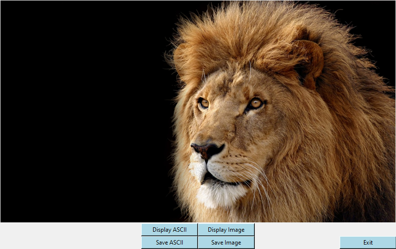
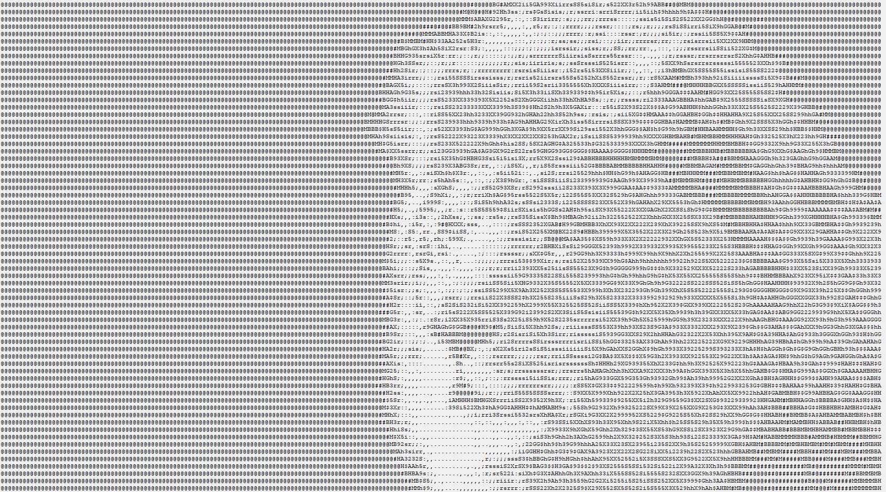
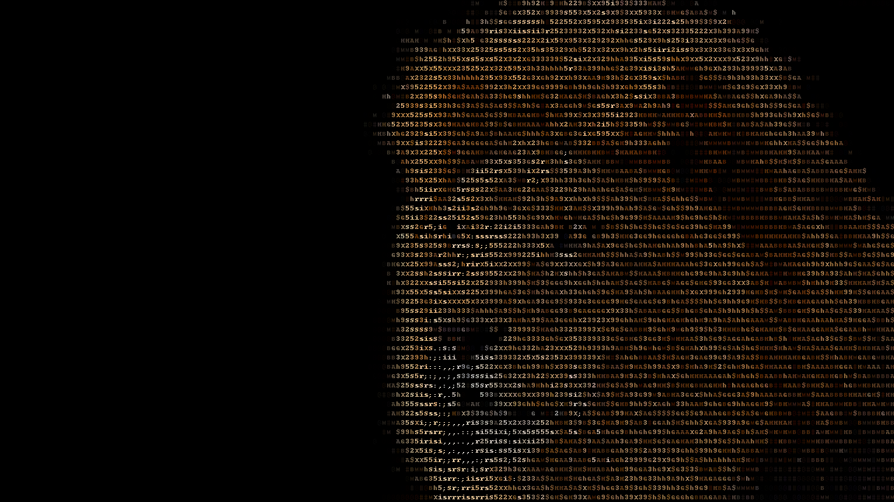

# ASCII-ART

## Описание
- Преобразование изображения в ASCII-ART
- Преобразование изображения в цветные ANSI символы
- Возможность просмотреть результат перед сохранением
- Возможность сохранить результат работы программы

## Запуск
1. Напишите python main.py 
2. Введите путь к файлу

## Пример работы программы

    

    

    

